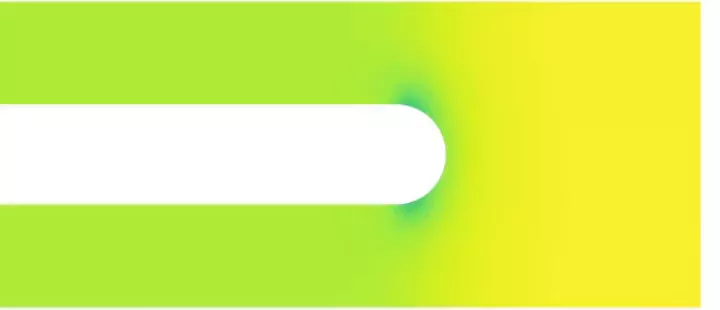

# SuperDetectorPy

SuperDetectorPy is a program used to simulate current-carrying thin-film type-ii
superconductors, such as superconducting single-photon detectors. It is able to:

- Simulate IV curves in general geometries and investigate the 
current crowding effect.
- Investigate the effect of applied magnetic field on superconductors.

## Getting started

Please refer to the [documentation](https://super-detector-py.readthedocs.io).

## License and citing

SuperDetectorPy is licensed under the MIT license. If you use SuperDetectorPy in
an academic publication or similar, please consider citing the following:

Mattias Jönsson, Theory for superconducting few-photon detectors 
(Doctoral dissertation), KTH Royal Institute of Technology (2022) 
([Link](http://urn.kb.se/resolve?urn=urn:nbn:se:kth:diva-312132))

Mattias Jönsson, Robert Vedin, Samuel Gyger, James A. Sutton, 
Stephan Steinhauer, Val Zwiller, Mats Wallin, Jack Lidmar, Current crowding in 
nanoscale superconductors within the Ginzburg-Landau model, arXiv:2112.05443 
(2021) ([Link](https://doi.org/10.48550/arXiv.2112.05443))
