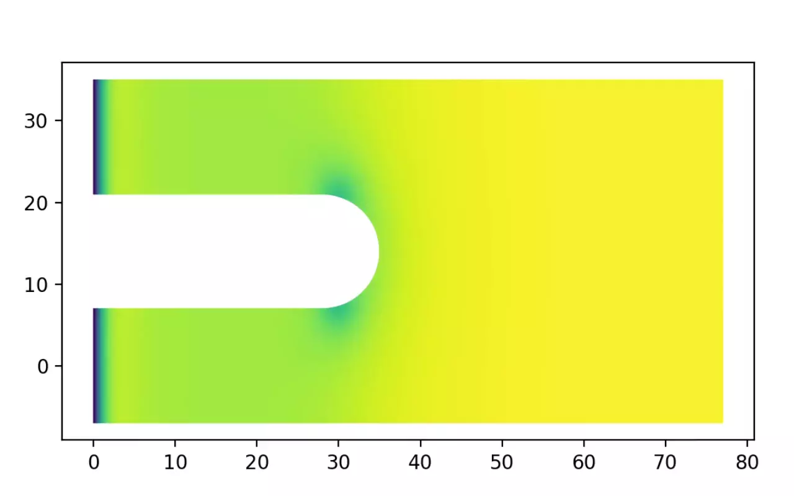

=========
Use cases
=========

Measure critical current
========================

SuperDetectorPy allows you to measure the critical current of a superconducting geometry by simulating an IV curve. This is done by slowly increasing the bias current, while measuring the voltage difference between the probe points in the superconductor. Using the condition presented in `Clem et al. <https://doi.org/10.1103/PhysRevB.85.144511>`_, we define the critical current to be the smallest current when non-stationary vortices nucleate in the superconductor. In practice, we translate this condition to the voltage increasing above some threshold level, which is slightly above the background. More information about the methodology is available in `Jönsson et al. <https://doi.org/10.48550/arXiv.2112.05443>`_ and in `Theory for superconducting few-photon detectors <https://urn.kb.se/resolve?urn=urn:nbn:se:kth:diva-312132>`_.

Run an IV curve simulation
--------------------------

IV curve simulations take a long time to complete since the current needs to increase sequentially and slowly to get accurate results. For this reason it is recommended to first run a couple of short exploratory simulations to figure out the approximate critical current and then run a slower simulation to increase the accuracy.

Let us run a IV curve simulation. Open a terminal, make sure to activate the ``SuperDetectorPy`` Anaconda environment (or the virtualenv), and navigate to the root fo the SuperDetectorPy repository. Run the following command after replacing ``RELATIVE_PATH_TO_MESH_FILE`` with the path to the mesh file

.. code-block:: bash

    python simulate.py RELATIVE_PATH_TO_MESH_FILE data/iv-example.h5 --miniters 1e5 -s 3e7 -t 0.01 --save-every 3e6 --skip 1e5 -j 0.0 -J 0.39 --steps-per-current 1e5 -b 0.0

The following parameters are used for the simulation:

- ``data/iv-example.h5`` the output file to store the data. Rename to something appropriate.

- ``--miniters 1e5`` only update the progress bar every :math:`1 \times 10^5` time steps. This is to prevent the log file to be too large when running in Slurm.

- ``-s 3e7`` run the simulation for :math:`3 \times 10^7` time steps.

- ``-t 0.01`` set the time step to be :math:`0.01 \tau`.

- ``--save-every 3e6`` save the full simulation state every :math:`3 \times 10^6` time step. Only 10 simulation frames are stored and this is done to reduce the output file size. The voltage and current is saved every time step.

- ``--skip 1e5`` thermalize the simulation for :math:`1 \times 10^5` simulation steps before starting the IV curve.

- ``-j 0.0 -J 0.39 --steps-per-current 1e5`` stepwise interpolate the current density between :math:`0.0 J_0` and :math:`0.39 J_0` with a constant current for :math:`1 \times 10^5` time steps.

- ``-b 0.0`` set the applied magnetic field to :math:`0.0 B_{c2}`.

Find the critical current
-------------------------

To find the critical current we start by plotting the IV curve that we simulated in the previous section.

.. code-block:: bash

    python visualize.py data/iv-example.h5 iv

.. _iv_example:

    An IV curve generated by the simulation tool. The critical current is slightly above :math:`0.25 J_0`.

The resulting IV curve is presented in :numref:`iv_example`. For current densities below :math:`0.25 J_0` the voltage is very close to zero and the system is in the superconducting state. The voltage becomes non-zero for current densities slightly above :math:`0.25 J_0`, which corresponds to the critical current.

Investigate critical current dependence on magnetic field
=========================================================

SuperDetectorPy allows you to investigate how applied magnetic fields affect the critical current in superconducting geometries by simulating multiple IV curves for different magnetic fields.

Run IV curve simulations for the magnetic field range
-----------------------------------------------------

IV curve simulations take a long time to complete, but are single threaded. This allows for parallelization when running on clusters or supercomputers. Before running the final simulations, it is recommended to first find the approximate minimum and maximum critical current values for the magnetic field range. This allows for running the final simulations in a narrower current interval, which increases accuracy and may reduce runtime.

Let us run the IV curves using Slurm to start multiple simulations in parallel. See the previous section for information about the parameters used or run :code:`python simulate.py -h`.

.. code-block:: bash

    #!/usr/bin/env bash
    #
    # Slurm commands. Check the documentation for your cluster/supercomputer for
    # the correct Slurm flags for your system.
    #
    #SBATCH --time=7-00:00:00
    #SBATCH --nodes=1
    #SBATCH --ntasks=1
    #SBATCH --cpus-per-task=1
    #SBATCH --mem-per-cpu=1000
    #SBATCH --output=logs/output_%A_%a.log
    #SBATCH --error=logs/error_%A_%a.log
    #
    # Specify the number of simulations to run. Should be an odd number if
    # b = 0.0 should be included.
    #
    #SBATCH --array=0-50

    # Specify the mesh.
    mesh="straight_20"

    # Set the number of steps.
    steps="3e7"

    # Min and max current.
    min_current=0.0
    max_current=0.39

    # The magnetic field range.
    bmin=-0.2
    bmax=0.2

    # Clear the environment from any previously loaded modules.
    module purge > /dev/null 2>&1

    # Load Python3.8.
    # Check the documentation for your cluster/supercomputer for the correct
    # imports on your system.
    module load GCCcore/10.2.0 Python/3.8.6

    # Start conda environment.
    conda activate SuperDetectorPy

    # Calculate the interpolated magnetic field for this IV curve using Python.
    b=$(python -c "
    b_min = $bmin
    b_max = $bmax
    slurm_id = $SLURM_ARRAY_TASK_ID
    slurm_count = $SLURM_ARRAY_TASK_COUNT

    b_val = (b_max - b_min) * slurm_id / (slurm_count - 1) + b_min
    print(round(b_val, 6))
    ")

    # Run simulation.
    ./simulate \
      "mesh/${mesh}.h5" "data/${mesh}/${b}.h5" \
      --miniters 1e5 \
      --steps "$steps" \
      --time-step 0.01 \
      --save-every 3e6 \
      --skip 1e5 \
      -j "$min_current" \
      -J "$max_current" \
      --steps-per-current 1e5 \
      -b "$b"

    # Deactivate conda environment.
    conda deactivate

Plot critical current as a function of the magnetic field
---------------------------------------------------------

There is one simulation file per magnetic field in the output directory after the Slurm simulations has finished. To plot the critical current vs magnetic field plot run the command:

.. code-block:: bash

    python visualize.py RELATIVE_PATH_TO_DATA_DIR ic-vs-b -t 0.01

The following parameters are used:

- ``-t 0.01`` the voltage threshold level that corresponds to the critical current is :math:`0.01 v_0`. May require some tweaking, depending on the background voltage level.

.. _ic_vs_b_example:

    Critical current dependence on the applied magnetic field for a straight superconductor.

Critical current dependence on the applied magnetic field for a straight superconductor is presented in :numref:`ic_vs_b_example`. For non-zero magnetic fields, the critical current effect is worsened and the critical current is reduced. Critical current dependence on applied magnetic fields for a general geometry is more complicated, see `Clem et al. <https://doi.org/10.1103/PhysRevB.85.144511>`_ and `Jönsson et al. <https://doi.org/10.48550/arXiv.2112.05443>`_ for details.

Visualize vortex motion
=======================

SuperDetectorPy allows you to generate animations, which is useful for understanding how the superconductivity breaks down.

Run a simulation with many frames
---------------------------------

Start a simulation with many frames saved. Each frame saved will add one frame in the simulation. Note that the output file increases in size for each frame saved.

Let us run a simulation. Open a terminal, make sure to activate the ``SuperDetectorPy`` Anaconda environment (or the virtualenv), and navigate to the root fo the SuperDetectorPy repository. Run the following command after replacing ``RELATIVE_PATH_TO_MESH_FILE`` with the path to the mesh file

.. code-block:: bash

    python simulate.py RELATIVE_PATH_TO_MESH_FILE data/animation-example.h5 -s 1e6 -t 0.01 --save-every 100 -j 0.35

The following parameters are used for the simulation:

- ``data/animation-example.h5`` the output file to store the data. Rename to something appropriate.

- ``-s 1e6`` run the simulation for :math:`1 \times 10^6` time steps.

- ``-t 0.01`` set the time step to be :math:`0.01 \tau`.

- ``--save-every 100`` save the full simulation state every :math:`100` time step.

- ``-j 0.35`` set the current density to :math:`0.35 J_0`.

Generate the animation
----------------------

Run the following command to convert the simulation file into a video:

.. code-block:: bash

    python visualize.py data/animation-example.h5 animate -f 60 -o COMPLEX_FIELD animation-example.mp4

The following parameters are used:

- ``-f 60`` sets the frame rate to :math:`60 \, \text{frames}/\text{s}`.
- ``-o COMPLEX_FIELD`` animate the complex field (superconducting order parameter).

.. _animation_example:

    Animation of the superconducting order parameter when vortices nucleate.

An edited version of the animation is presented in :numref:`animation_example`. From the animation it is clear that the weakest part of the superconductor is where the inner bend starts.