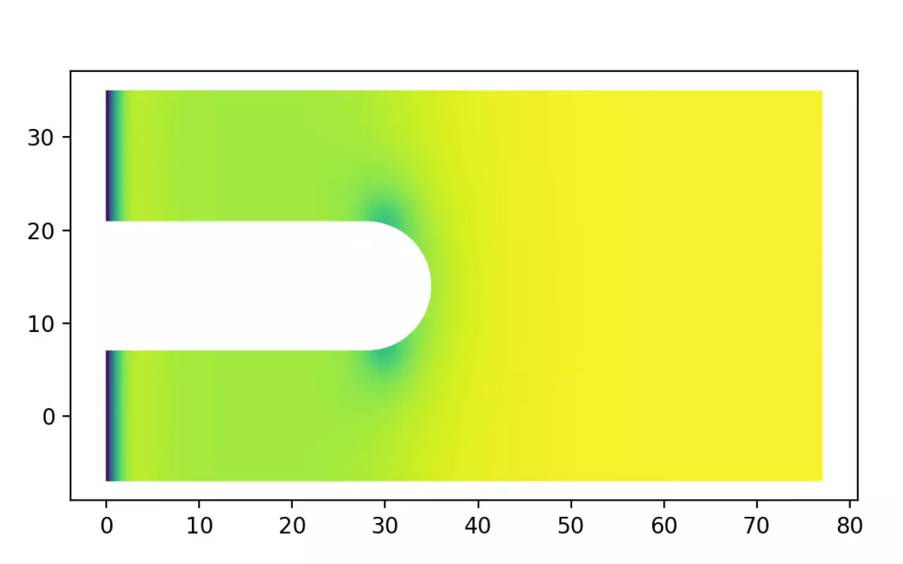

============
Introduction
============

SuperDetectorPy is a program used to simulate current-carrying thin-film type-ii superconductors, such as superconducting single-photon detectors (SSPDs). The program was developed as a part of Mattias Jönsson's doctoral thesis `Theory for superconducting few-photon detectors <https://urn.kb.se/resolve?urn=urn:nbn:se:kth:diva-312132>`_.

Features and limitations
========================

SuperDetectorPy solves the generalized time-dependent Ginzburg-Landau (GTDGL) model in the regime where the thickness of the superconductor :math:`d` is much smaller than the London penetration depth :math:`\lambda`, i.e. :math:`d \ll \lambda`, and the width of the superconductor :math:`W` is much smaller than the Pearl length :math:`\Lambda = 2 \lambda^2 / d`, i.e. :math:`W \ll \Lambda`. These conditions are generally met in SSPDs and the program may therefore be used to study SSPDs.

By using a finite volume method, SuperDetectorPy is able to run simulations on general geometries. This allows for studying the breakdown of superconductivity in geometries with smooth boundaries, such as like turnarounds in SSPD meanders.

SuperDetectorPy is also capable of simulating applied magnetic fields, which allows for studying SSPDs in magnetic fields.

License and citing
==================

SuperDetectorPy is licensed under the `MIT license <https://github.com/afsa/super-detector-py/blob/main/LICENSE.md>`_. If you use SuperDetectorPy in an academic publication or similar, please consider citing the following:

Mattias Jönsson, Theory for superconducting few-photon detectors (Doctoral dissertation), KTH Royal Institute of Technology (2022) (`Link <http://urn.kb.se/resolve?urn=urn:nbn:se:kth:diva-312132>`_)

Mattias Jönsson, Robert Vedin, Samuel Gyger, James A. Sutton, Stephan Steinhauer, Val Zwiller, Mats Wallin, Jack Lidmar, Current crowding in nanoscale superconductors within the Ginzburg-Landau model, arXiv:2112.05443 (2021) (`Link <https://doi.org/10.48550/arXiv.2112.05443>`_)