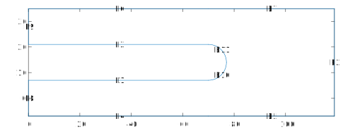

===============
Generate meshes
===============

Meshes in SuperDetectorPy define the simulation geometry and the corresponding discretization. The meshes are generated with Matlab scripts that use the Matlab PDE toolbox. Example Matlab scripts are provided in this repository to help when generating meshes for new geometries.

Units used in meshes
====================

SuperDetectorPy runs all simulations in dimensionless units, which means that the lengths in the meshes are measured in the superconducting coherence length. For materials used in superconducting single-photon detectors (e.g. NbN, NbTiN, WSi, etc) the coherence length is typically around ``5 - 10 nm``. More information about the dimensionless units is available in section 2.2.1 in `Theory for superconducting few-photon detectors <https://urn.kb.se/resolve?urn=urn:nbn:se:kth:diva-312132>`_.

Generate mesh for a new geometry
================================

Open Matlab in the directory ``meshing``, which is located in the root of the repository. Copy the boilerplate mesh ``circle_turnaround_mesh.m`` and call it something appropriate. Open the copied file in Matlab.

The boilerplate code consists of five sections, which are intended to be run sequencially (use ``ctrl + enter`` to run the section marked by cursor). Make sure to always run the section after you make an update of it.

General settings
----------------

The general settings section contains settings for mesh size and output path for the generated mesh.

.. code-block:: matlab

    % Define the geometry scale. This option allows for quickly rescaling the
    % geometry. This geometry is defined such that scale = 1 corresponds to a
    % leg width of one coherence length.
    scale = 14;

The ``scale`` parameter sets the scale of the geometry and allows for quick rescaling. By default in the boilerplates, ``scale = 1`` corresponds to a wire width of one coherence length. A typical NbN nanowire used in superconducting single-photon detectors is around 20 coherence lengths (which is around ``100 nm``).

It is recommended to set the scale parameter to ``scale = 1`` when creating a new mesh. The scale parameter may then be updated to something appropriate after the mesh script is finished.

.. code-block:: matlab

    % Define the output directory and the output file name.
    % The output directory is created if it does not exist.
    outputDir = '../mesh';
    fileName = sprintf('circle_%d.h5', scale);

The path for the output mesh file is defined by setting the ``outputDir`` and the ``fileName``. If the ``outputDir`` does not exist, then it is created.

.. note::

    The Matlab script never overwrites mesh files. If the mesh file already exists, then it fails with an error.

Generate geometry
-----------------

The generate geometry section is used to define the superconducting geometry used in the simulation. This is done in two steps:

1. Define simple geometrical shapes, e.g. polygons, circles, and ellipses.

2. Combine these geometrical shapes into the simulation geometry using unions, intersections, and differences.

.. _geometry_example:

    An example of the expected output from running the generate geometry section when it is completed. The edge labels are displayed on each edge prefixed with ``E``.

:numref:`geometry_example` depicts an example output figure from running this section. In this example, three rectangular polygons and one circle were defined. Then, a union operation combined the three rectangular polygons. The circle was then subtracted from the result of the union operation.

Below follows instructions on how to define polygons, circles, ellipses, and how to combine the shapes into the final geometry.

Defining a polygon
~~~~~~~~~~~~~~~~~~

.. code-block:: matlab

    points = [
        5,  0.5;
        0,  0.5;
        0, -0.5;
        5, -0.5
    ];

    P1 = makePolygon(points, scale);

A polygon is created using the ``makePolygon`` function.

- ``points`` is a ``n x 2`` matrix of vertex points ``(x, y)`` in counterclockwise order.

- ``scale`` is the scale factor defined in the previous section.

Defining a circle
~~~~~~~~~~~~~~~~~

.. code-block:: matlab

    center = [0, 1];
    radius = 1;

    C1 = makeCircle(center, radius, scale);

A circle is created using the ``makeCircle`` function.

- ``center`` is the coordinates of the circle center ``(x, y)``.

- ``radius`` is the radius of the circle.

- ``scale`` is the scale factor defined in the previous section.

Defining an ellipse
~~~~~~~~~~~~~~~~~~~

.. code-block:: matlab

    center = [0, 1];
    radiusX = 1;
    radiusY = 2;

    E1 = makeEllipse(center, radiusX, radiusY, scale);

An ellipse is created using the ``makeEllipse`` function.

- ``center`` is the coordinates of the circle center ``(x, y)``.

- ``radiusX`` is the radius in the x direction of the circle.

- ``radiusY`` is the radius in the y direction of the circle.

- ``scale`` is the scale factor defined in the previous section.

Combining shapes
~~~~~~~~~~~~~~~~

.. code-block:: matlab

    setFormula = 'P1+(C1-E1)';

    symbols = char('P1', 'C1', 'E1');

    g = makeGeometry(setFormula, symbols, P1, C1, E1);

All shapes created in previously in this section must be combined into one geometry. This is done by applying the set operations, union, intersection, and difference, on the shapes.

The ``makeGeometry`` function combines the shapes into a combined geometry.

- ``setFormula`` is the formula for combining the shapes (see the `Matlab docs <https://se.mathworks.com/help/pde/ug/decsg.html#bu_fft3-sf>`_ for details). The operation union, intersection, difference use the symbol ``+``, ``*``, ``-``, respectively. Parentheses may be used to specify the order of execution.

- ``symbols`` defines all variables used in the the ``setFormula``.

- The remaining parameters are the variables holding the shape values. The order needs to be the same as in ``symbols``.

Geometry settings
-----------------

This section is used to specify which boundaries that forces current into the superconductor and to place the voltage probes.

.. code-block:: matlab

    % Define the input and output edges for the current flowing through the
    % superconductor. The edge labels are found by running the section
    % "Generate geometry".
    %
    % NOTE: The length of the input and output edges need to have the same
    % length. The code has not been tested with non-vertical input and output
    % edges.
    inputEdge = 8;
    outputEdge = 9;

The ``inputEdge``, ``outputEdge`` species the edge that forces current into, out of the superconductor, respectively. The numbers specified are the edge labels, which are displayed in the plot from the previous section (see :numref:`geometry_example` as an example).

.. note::

    In the simulation, these edges are superconductor-to-metal interfaces. By setting the gradient of the electric scalar potential as a boundary condition, it is possible to specify the normal current density flowing through the boundary. The superconducting order parameter is suppressed near these boundaries due to the proximity effect, which may cause unexpected behaviors. Always leave a buffer region between these boundaries and the regions of interest.

.. note::

    The input and output edges need to have the same length, since the same current density flows through the edges. If they have different lengths, then current is not conserved and the simulation breaks down.

.. code-block:: matlab

    % Define the probe points to measure voltage between.
    %
    % NOTE: The probe points should not be too close to the input and output
    % edges as the superconductor is suppressed close to these edges. If a too
    % small buffer region is used, then the voltage is non-zero in the
    % superconducting state.
    voltageStart = [1, 0] * scale;
    voltageEnd = [1, 2] * scale;

The ``voltageStart``, and ``voltageEnd`` are the points were voltage probes are placed. During the simulation, the voltage difference between these points is measured.

.. note::

    Placing the voltage probes too close to the input and output boundaries may result in a non-zero voltage in the superconducting state. This is due to the superconductor being suppressed close to these boundaries and some normal current may flow there

Generate mesh
-------------

This section is used to generate a mesh for the geometry defined in the previous sections. By default the maximal link length is one half coherence length and the minimal link length is ``sqrt(0.1)`` coherence length. Reducing these sizes reduces the discretization error, but also forces a shorter time step to ensure stability. The current sizes are selected such that a time step of ``0.01`` may be used when ``gamma = 10`` and ``u = 5.79``.

Save mesh
---------

This section saves the results from the previous sections into a HDF5 mesh file, which is saved to the location defined in the start of the script.

Compile the mesh
----------------

The HDF5 mesh file has been created after running the save mesh section in the Matlab script, but the mesh file still needs to be compiled before being used in simulations. To compile the mesh, the provided Python script ``compile-mesh.py`` should be used.

Open a terminal, make sure to activate the ``SuperDetectorPy`` Anaconda environment (or the virtualenv), and navigate to the root fo the SuperDetectorPy repository. Run the following command after replacing ``RELATIVE_PATH_TO_MESH_FILE`` with the path to the uncompiled mesh file

.. code-block:: bash

    python compile-mesh.py RELATIVE_PATHS_TO_MESH_FILES

The compile script updates the uncompiled mesh file into a compiled mesh file and the updated file may be used for simulations.

.. note::

    Multiple meshes may be compiled simultaneously by providing a space separated list of mesh paths. The compile script ignores any meshes that are already compiled.

    .. code-block:: bash

        python compile-mesh.py RELATIVE_PATH_TO_MESH_FILE1 RELATIVE_PATH_TO_MESH_FILE2 ...