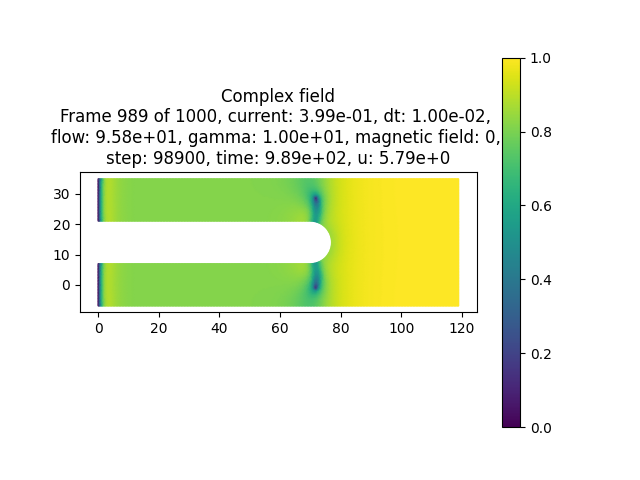

===============
Run simulations
===============

SuperDetectorPy contains scripts for both running simulations and visualizing the results. In this guide we go through how to run a simple simulation.

Run a simulation
================

Make sure to have a compiled mesh for the geometry that you wish to simulate. If you do not have any meshes, then follow the steps in this guide `here <mesh.html>`_.

Open a terminal, make sure to activate the ``SuperDetectorPy`` Anaconda environment (or the virtualenv), and navigate to the root fo the SuperDetectorPy repository. Run the following command after replacing ``RELATIVE_PATH_TO_MESH_FILE`` with the path to the mesh file:

.. code-block:: bash

    python simulate.py RELATIVE_PATH_TO_MESH_FILE data/test-output.h5 -s 1e5 -t 0.01 -j 0.3 -J 0.4

The following parameters are used:

- ``data/test-output.h5`` specifies the output file.

- ``-s 1e5`` run the simulation for :math:`1 \times 10^5` time steps.

- ``-t 0.01`` run the simulation with time step :math:`0.01 \tau`.

- ``-j 0.3 -J 0.4`` interpolate the current density from :math:`0.3 J_0` at the start of the simulation to :math:`0.4 J_0` at the end of the simulation.

For information on how :math:`\tau` and :math:`J_0` are defined, please refer to section 2.2.1 in `Theory for superconducting few-photon detectors <https://urn.kb.se/resolve?urn=urn:nbn:se:kth:diva-312132>`_.

Visualize the result
====================

To visualize the results of the simulation run

.. code-block::

    python visualize.py data/test-output.h5

A Matplotlib window with the simulation results is opened. The following keys may be used to switch what is displayed:

- ``right arrow`` jump to the next saved time step.

- ``left arrow`` jump to previous saved time step.

- ``shift + right arrow`` jump forward 10 saved time steps.

- ``shift + left arrow`` jump backwards 10 saved time steps.

- ``up arrow`` jump forward 100 saved time steps.

- ``down arrow`` jump backwards 100 saved time steps.

- ``shift + up arrow`` jump forward 1000 saved time steps.

- ``shift + down arrow`` jump backwards 1000 saved time steps.

- ``1`` display the amplitude of superconducting order parameter.

- ``2`` display the phase of superconducting order parameter.

- ``3`` display supercurrent density.

- ``4`` display normal current density.

- ``5`` display electrical scalar potential.

- ``6`` display magnetic vector potential.

- ``7`` display Ginzburg-Landau alpha parameter.

.. _result_example:

    A saved frame of the amplitude of the superconducting order parameter from the simulation above.

:numref:`result_example` depicts the amplitude of the superconducting order parameter when vortices enter the superconductor for the simulation ran in the previous section.

.. warning::

    Quantities defined on the links between Voronoi sites (e.g. supercurrent and normal current) are not displayed correctly. The quantities vary slightly depending on the size and number of neighbours for each Voronoi site. This is not due to issues with the simulations, but rather due to difficulty to plot quantities defined on the dual mesh.
